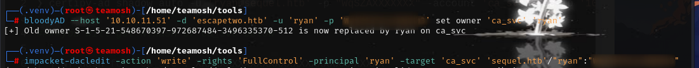

### nmap

### bloodhound ldap

> btw, if you want to install bloodhound ce\bloodhound-python, [here](https://www.centralinfosec.com/blog/bloodhound-kali-install) or [here](https://github.com/dirkjanm/BloodHound.py) is good guide for kali. ALso if you are like me and couldnt reset password do these (tho it didnt help me and i just downloaded to windows):

`docker rm desktop_app-db_1` 
`docker rm desktop_bloodhound_1`
`docker rm desktop_graph-db_1`
`docker rmi neo4j:4.4`
`docker rmi postgres:16`
`docker rmi specterops/bloodhound`
`docker system prune --volumes --force` 

where, desktop is ur parent folder for docker-compose file.

### crackmapexec enum:

Hm, there is an interesting share, named Accounting Department

>

>

>

It looks like there are 2 excel files. 😡. So im forced to install libreoffice to open it. fk mate. (Nevermind, libreoffice is cancer to download\debug, and a lot of errors. FOund another alternative named - gnumeric so just use that)

>

Of course, it is corrupted\ cannot be opened with new versions of excel openers. So Just make it .zip and check everyfile 

Turns out it contains emails and passwords. User sa seems sus, and he contains MSSQLP@ssw0rd! as password. So my guess is -> it is mssql 
>

>

xp_cmdshell is disabled, so enable it:
>
 

Now rebound shell using forbidden, very super secret chinese tool by [Mayter](https://github.com/Mayter/mssql-command-tool/releases/tag/mssql) or [Nishang tool](https://github.com/samratashok/nishang/blob/master/Shells/Invoke-PowerShellTcpOneLine.ps1) or even PowerJoker. 

> Note: Always recheck ur IP with ifconfig, for some reason htb vpn generated 2 IPS for me WHICH MADE ME WASTE 2 HOURS ON REV SHELL, since I wasnt able connect it properly.

There is a SQL2019 folder at root dir, so just use script to find interisting files like .ini (can be found in my cheatsheet). 

>
>
>

It found this file, which contained password. Now its **bruteforcing** time.

Enumerate users and bruteforce that shi

>

Ryan, got yo ass:

>

Now connect through evil-winrm or other of ur choice and get user flag:

---

root.txt

>

there is a esc4 to esc1

> now give rights, shadow creds and do targeted kerberoasting
>
>

> get certificate
>

> then hash
> 
>

Now just connect and get your root.txt